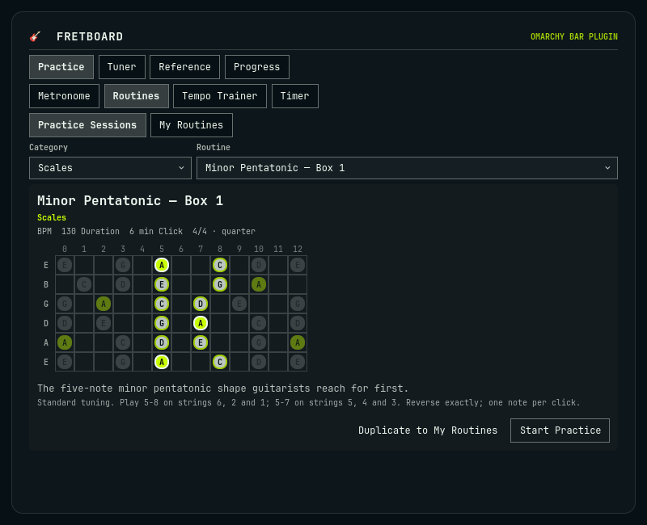
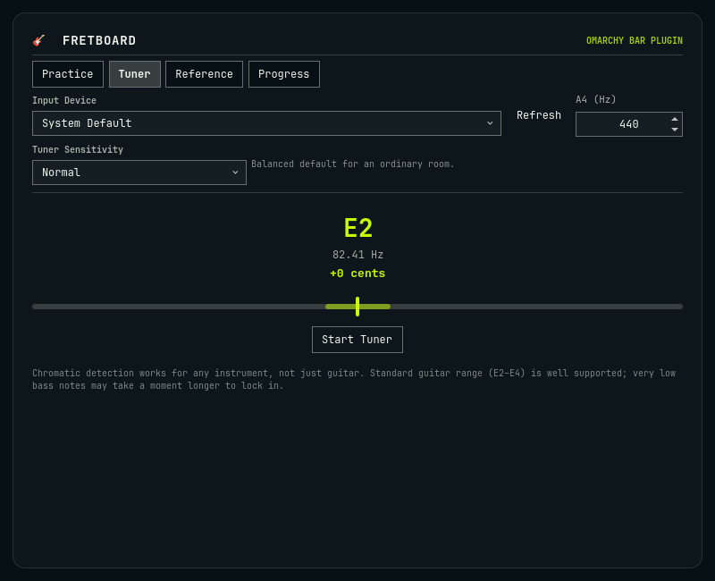
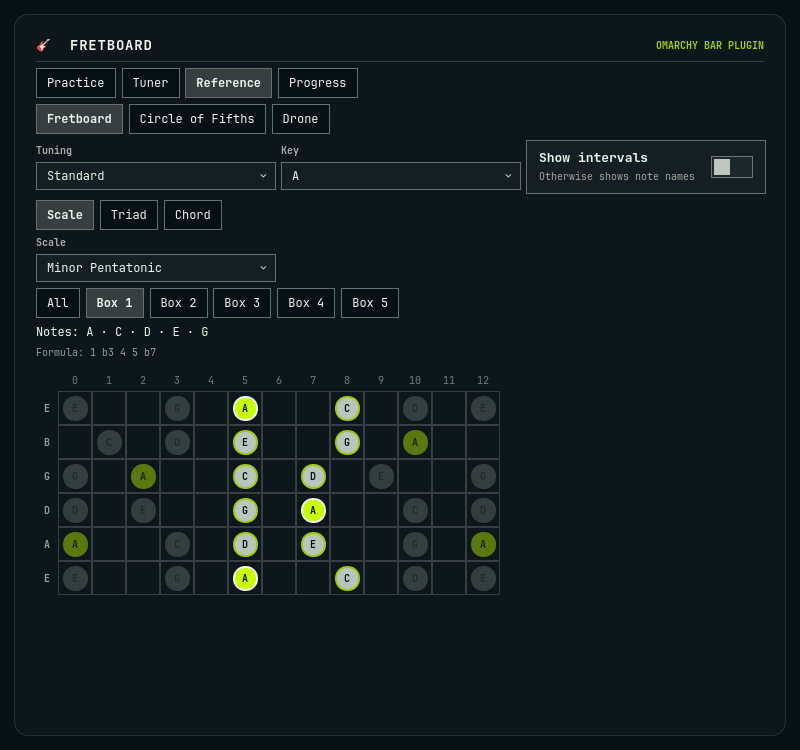

# Fretboard

**Your guitar practice room, built into the Omarchy bar.**



Fretboard brings the tools you actually use while practising guitar into one focused
Omarchy panel.

Tune up, start a metronome, choose from 40 guided practice sessions, explore scales
and chords across the fretboard, build your own routines, and track your progress.

**No account. No cloud. No telemetry. Just pick up your guitar and practise.**

Requires Omarchy 4.0.3 or later.

## Guided practice

The 40 built-in sessions cover Warmups, Scales, Scale Patterns, Triads, Chords,
Technique, and Rhythm. Pick a category and routine from compact selectors, then get
one focused lesson with a useful visual, clear instructions, suggested tempo, and
duration. Start it and the visual stays on screen while you play.

- Full six-string scale maps and verified pentatonic positions
- Numbered paths for scale sequences, spider drills, and string skipping
- Picking directions for alternate/economy-picking work
- Exact triad and chord shapes with interval labels
- Beat grids for subdivisions, accents, syncopation, and compound 6/8
- Editable personal routines created from the verified built-ins

## Practice tools

- **Metronome:** 30–300 BPM, tap tempo, beat-one accents, visual beat indicator,
  volume, eight time signatures, and four click divisions
- **Tempo trainer:** move from a start tempo to a target by elapsed time or bars
- **Practice timer:** common presets or a custom duration, optionally linked to the
  metronome
- **Progress:** local session history, practice minutes, streaks, and user-recorded
  Clean/Nearly/Needs Work outcomes with conservative next-tempo suggestions

## Tuner

The chromatic tuner shows note, octave, frequency, and cents offset. It supports an
adjustable A4 reference, input-device selection, and Quiet/Normal/Noisy Room
sensitivity modes. Pitch detection is chromatic, so it can also listen to other
single-note instruments.



## Reference

Explore 14 scales and modes as complete open-string-to-fret-12 maps. Every matching
tone is calculated independently across all six strings from the active tuning;
roots stay distinct, and labels switch between note names and intervals.

Verified A minor pentatonic Boxes 1–5 highlight their exact coordinates without
hiding the rest of the scale. The same reference includes verified
major/minor/diminished/augmented triad inversions and string sets, 11 chord families,
eight built-in tunings, custom tunings, a circle of fifths, and a reference drone.



The bundled tunings are Standard, Drop D, D Standard, Drop C, Eb Standard, Open G,
Open D, and DADGAD. Standard-tuning chord and named-position diagrams are never
presented as valid shapes under an incompatible tuning; pitch membership still
recalculates correctly.

## Routines and progress

Practice Sessions are immutable templates. Duplicate one into **My Routines** to
rename, reorder, remove, or combine its items without changing the original. The
running view keeps the exercise visual, BPM, timer, metronome state, concise prompt,
and next/finish controls together while your hands are on the guitar.

Practice history and progress live only on this machine. Fretboard does not analyze
performance or claim to replace a teacher: outcomes and tempo changes are recorded
from your input.

## Installation

Add and enable the repository directly:

```bash
omarchy plugin add https://github.com/3EYE3Y3/omarchy-fretboard.git --enable
```

Or install it manually:

```bash
git clone https://github.com/3EYE3Y3/omarchy-fretboard.git ~/.config/omarchy/plugins/io.github.3eye3y3.fretboard
omarchy plugin enable io.github.3eye3y3.fretboard right
```

Once listed in the official marketplace, Fretboard can also be installed by its
permanent plugin ID: `io.github.3eye3y3.fretboard`.

### Removal

```bash
omarchy plugin disable io.github.3eye3y3.fretboard
omarchy plugin remove io.github.3eye3y3.fretboard --yes
```

Removal deletes the plugin code. Practice data is deliberately left at
`$XDG_STATE_HOME/omarchy/fretboard/state.json` (normally
`~/.local/state/omarchy/fretboard/state.json`) so an uninstall cannot silently erase
your history. Delete that file yourself for a complete reset.

## Usage

Click the guitar icon in the bar to open Fretboard, or run:

```bash
omarchy-shell io.github.3eye3y3.fretboard open
```

The panel starts in **Practice**. Its other main tabs are **Tuner**, **Reference**,
and **Progress**. All interactive controls participate in the normal Qt keyboard
focus chain; Escape closes the panel.

Optional IPC actions are available for shortcuts:

```bash
omarchy-shell io.github.3eye3y3.fretboard startMetronome
omarchy-shell io.github.3eye3y3.fretboard stopMetronome
omarchy-shell io.github.3eye3y3.fretboard startPreset preset-warmup-chromatic
omarchy-shell io.github.3eye3y3.fretboard startRoutine <routine-id>
```

## Audio dependencies

Fretboard uses the PipeWire command-line tools already present in Omarchy:

- `pw-cat` plays the metronome and drone.
- `pw-record` captures microphone samples for the tuner.
- `pactl` lists available tuner input devices.

`Service.qml` launches only the bundled local Python helpers, which communicate over
stdio and in turn launch those local PipeWire tools. They run without privileges,
make no network requests, and terminate their PipeWire children on shutdown.

Pitch detection uses the bundled YIN implementation. NumPy is used for its faster
FFT path when available, with a tested pure-Python fallback when it is not. No Python
package installation is required. The complete design and lifecycle are documented
in [Architecture](docs/ARCHITECTURE.md).

## Privacy and data

Fretboard has no account, cloud service, analytics, advertising, or telemetry. It
does not contact a remote API at runtime. Microphone audio is processed locally in
memory for pitch detection and is not recorded to disk or transmitted.

Preferences, custom tunings, routines, songs, practice sessions, and progress are
stored in one owner-only, atomically replaced JSON file under XDG state storage.
Built-in music/reference data remains part of the plugin code. See
[Architecture](docs/ARCHITECTURE.md) for the exact schema.

## Limitations

- The tuner detects one fundamental at a time; play a single note or harmonic, not a
  full chord.
- Guitar range E2–E4 is its primary tuning target. Very low bass notes take a little
  longer to settle.
- Input level still depends on your system microphone settings. Sensitivity changes
  confidence/noise gating, not hardware gain.
- Curated chord diagrams and named pentatonic/triad shapes are verified for Standard
  tuning. Other tunings receive accurate pitch maps without misleading shape names.
- Progress is a practice log based on your own outcome selection, not automatic
  performance grading.

## Development and testing

```bash
npm test
python3 -m unittest discover -s helper/tests
./scripts/quality
```

The quality gate also runs `omarchy plugin validate .`, `qmllint`, and
`git diff --check`. See [Testing](TESTING.md), the independent
[music-content audit](docs/MUSIC_CONTENT_AUDIT.md), the
[practice-visual audit](docs/PRACTICE_VISUAL_AUDIT.md), and the
[changelog](CHANGELOG.md).

## License

Fretboard is available under the [MIT License](LICENSE).
